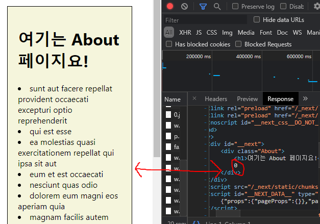

# NextJS Introduction

## Create Next App

- NextJs 프로젝트를 생성하는 CLI

```
npx create-next-app
# or
yarn create next-app
```

- TypeScript로 프로젝트를 시작하려면

```
npx create-next-app@latest --typescript
# or
yarn create next-app --typescript
```

## NextJs에서 hydrate란?

NextJs 프레임워크의 동작원리를 제대로 파악하고 있는 개발자면 `hydrate`에 대해 들어봤을 것이다.

hydrate는 NextJs의 주요 동작 방식중 하나인데, Server Side 단에서 렌더링된 정적 페이지외 번들링된 JS파일을 클라이언트에게 보낸 뒤, 클라이언트 단에서 **HTML 코드와 React인 JS코드를 서로 매칭 시키는 과정**을 말한다.

클라이언트가 받은 웹페이지는 단순 웹 화면만 보여주는 HTML일 뿐이고, 자바스크립트 요소들이 하나도 없는 상태이다(NextJs사용시). 실제로 자바스크립트의 요소도 하나도 없는 상태이고 빈 껍데기일 뿐인 HTML파일이 어떻게 리액트와 호환되는것일까? 바로 `Hydrate` 때문이다.

NextJs는 Server에서 Pre-Rendering된 웹페이지를 클라이언트에게 보내고 나서, 리액트가 번들링된 자바스크립트 코드들을 클라이언트에게 전송한다.

네트워크 탭을 보면, 맨 처음 응답받는 요소가 document Type의 파일이고, 이후에 React 코드들이 렌더링 된 JS 파일들이 Chunk 단위로 다운로드되는 것을 확인할 수 있다.

그리고 이 자바스크립트 코드들이 이전에 보내진 HTML DOM 요소 위에서 한번 더 렌더링을 하면서, 각자 자기 자리를 찾아가며 매칭이 된다.

이 과정을 **Hydrate**라고 부른다.

## Page

NextJs는 라우팅이 없다. 대신 pages 폴더안에서 디렉토리 구조로 라우팅을 할 수 있다.

- page 폴더에 react component를 만들면 **자동으로 라우팅**이 된다.
- NextJs는 이 파일의 이름을 가지고와 **URL의 이름**으로 사용한다.
- 이 작은 기능이 개발 시간을 절약해준다.
- reactJs를 import 할 필요 없다.

## 동적 경로가 필요한 페이지

NextJs는 동적 경로가 있는 페이지를 지원한다. `params`의 key값이 `id`라면 `page/posts/[id].js`에 액세스 할 수 있다.

더 많은 파라미터를 받으려면 `page/posts/[...id].js`

## 데이터 페칭

NextJs에서 데이터를 가져오면 애플리케이션의 사용 사례에 따라 다양한 방식으로 콘텐츠를 렌더링할 수 있다. **서버 측 렌더링** 또는 **정적 생성을 사용한 사전 렌더링**

## Pre-Rendering

NextJs는 기본적으로 모든 페이지를 **미리 렌더링 한다.** **정적 생성**과 **서버 측 렌더링** 두가지의 사전 렌더링 기법이 있다.

- 정적생성(SSG): HTML은 **빌드 시** 생성 되며 각 요청에 재사용 된다.
- 서버 측 렌더링(SSR): HTML은 **각 요청**에 대해 생성된다.

모든 페이지를 미리 렌더링해서 서버측에서 html파일만 제공하면 아래와 같은 장점이 있다.

CSR은 자바스크립트로 페이지를 렌더링하는 과정이 있기 때문에 자바스크립트가 실행되는 동안 유저가 빈 화면을 보게된다. 하지만 Pre-Rendering을 하게 되면 유저가 빈 화면을 볼 일이 없다.

또한 SEO에 최적화 되어있다. (대부분 `next-seo`라는 라이브러리를 많이 사용한다.)

## NextJs에서 SSR 및 SSG 개념

NextJs는 브라우저에 렌더링할 때 기본적으로 pre-rendering을 한다. pre-rendering이란 각 페이지들을 사전에 미리 HTML 문서로 생성하여 가지고 있는 것이다.

두 방식은 NextJs에서 pre-rendering을 어떻게 그리고 언제 제공할 것인지에 대한 차이이다.

퍼포먼스에 집중하거나 마케팅페이지 or 블로그 게시글 같은 정적인 사이트는 `SSG`를 하는것이 좋고

항상 최신상태를 유지해야하거나 제품의 상세페이지등의 페이지를 제공할 때 `SSR`을 사용한다.

## Server Side Rendering

NextJs에서 SSG와 SSR을 어떻게 적용하는지 살펴보자.

### SSG

먼저 useEffect로 데이터를 페칭하여 컴포넌트가 마운트 되었을 때 화면에 뿌려주는 방식으로 작성해보자.

```js
import React, { useEffect, useState } from 'react';
import axios from 'axios';

const About = () => {
  const [list, setList] = useState([]);

  useEffect(() => {
    const getList = async () => {
      const res = await axios.get(`https://jsonplaceholder.typicode.com/posts`);
      const data = res.data;
      setList(data);
    };
    getList();
  }, []);

  return (
    <div className="About">
      <h1>여기는 About 페이지요!</h1>
      {list.length && list.slice(0, 10).map(item => <li key={item.id}>{item.title}</li>)}
    </div>
  );
};

export default About;
```

해당 페이지를 진입하는 순간을 잘 생각해보면 데이터가 다 불러와지기 전에 NextJs에서 pre-rendering을 진행한다. 따라서 데이터가 없는 페이지를 클라이언트에게 보내준다. 따라서 HTML 소스를 보면 문서를 생성하는 시점에 데이터가 없으니 `0`이라고 나온다.



### getServerSideProps

각 요청마다 제목, 내용 등이 매 요청시 다르면 SSR 방식으로 각기다른 HTML 문서를 생성하여 반환하도록 하는 방식이 적절하다.

- `getServerSideProps` 함수에서 가지고 오면 된다. `getServerSideProps` 함수는 nextJs에서 제공하는 함수이며 **서버에서 동작한다.**
- 서버에서 돌아가기 때문에 **API키를 넣어도 클라이언트에서 보이지 않는다.**
- NextJs는 props를 `__NEXT_DATA__` 부분에 넣어준다.
- `ctx`라는 인자를 받고있는데 이는 다양한 정보에 접근이 가능하다.(공식문서 확인)

```js
import React from 'react';

const Detail = ({ item }) => {
  return (
    <div className="Detail">
      <h1>{item.title}</h1>
    </div>
  );
};
export async function getServerSideProps(ctx) {
  const { id } = ctx.params;
  const url = `http://localhost:3000/api/movies/${id}`;
  const { results } = await (await fetch(url)).json();

  return {
    props: {
      item: results,
    },
  };
}
```

## getStaticProps

`빌드 시에 딱 한 번`만 호출되고, 바로 static file로 빌드된다.. 따라서, 이후 수정이 불가능하다. 빌드 후 고정된 내용이 있는 page가 있는 경우 사용하는것이 좋다.

장점은 호출 시 매번 data fetch를 하지 않으니 `getServerSideProps`보다 성능이 좋다.

## 내장 CSS

### css module

- css module 지원 [name].module.css

### Styles JSX

- `style` 태그로 스타일링 할 수 있다.
- 파일 import 할 필요없이 js 내에서 사용할 수 있어서 편하다.

```js
<style jsx>
  {`
    .nav {
      background-color: tomato;
    }
    a {
      color: red;
    }
  `}
</style>
```

global style 적용하는 방법

```js
<style jsx global>
  ...
</style>
```

## 페이지 이동은 Link 태그로

- a태그로 페이지 이동하면 안된다. (새로고침됨)
- Link 태그 내부에 a태그를 사용하는 이유는 스타일링 때문(?)
- Link 태그는 href 때문에 사용 only

```js
import Link from 'next/link';
export default function NavBar() {
  return (
    <nav>
      <Link href="/">
        <a>Home</a>
      </Link>
      <Link href="/about">
        <a>about</a>
      </Link>
    </nav>
  );
}
```

- useRouter 훅

## Custom App

React를 사용하면 재사용 되는 컴포넌트들이 있다.

NextJS는 `_app.js`내의 우리가 작성한 컴포넌트를 App 컴포넌트의 Props로 전달한다.

```js
// ./_app.js
import Layout from '../components/layout'
export default function App({ Component, pageProps }) {
  return (
    <Layout/>
    <Component {...pageProps} />
    <Layout>
    )
}
```

```js
// components/layout.js

import Navbar from './navbar';
import Footer from './footer';

export default function Layout({ children }) {
  return (
    <>
      <Navbar />
      <main>{children}</main>
      <Footer />
    </>
  );
}
```

## Redirect and Rewrite

API 키 숨길 수 있다. `next.config.js`파일을 수정해보자.

request에 mask를 씌우는것 같은 redirect와 rewrite

```js
const API_KEY = 'aea317dd46e4b586cf0b438e18a866f0';
const nextConfig = {
  reactStrictMode: true,
  async redirects() {
    return [
      {
        source: '/contact',
        destination: 'https://naver.com',
        permanent: false, // 영구적인지 아닌지에 따라 브라우저나 검색엔진이 이 정보를 기억하는지 여부가 결정된다.
      },
    ];
  },
  async rewrites() {
    return [
      {
        source: '/api/movies',
        destination: `https://api.themoviedb.org/3/movie/popular?api_key=${API_KEY}`,
      },
    ];
  },
};

module.exports = nextConfig;
```

## 참고자료

[React 개발이 이렇게 쉬웠나?](https://geonlee.tistory.com/229)
